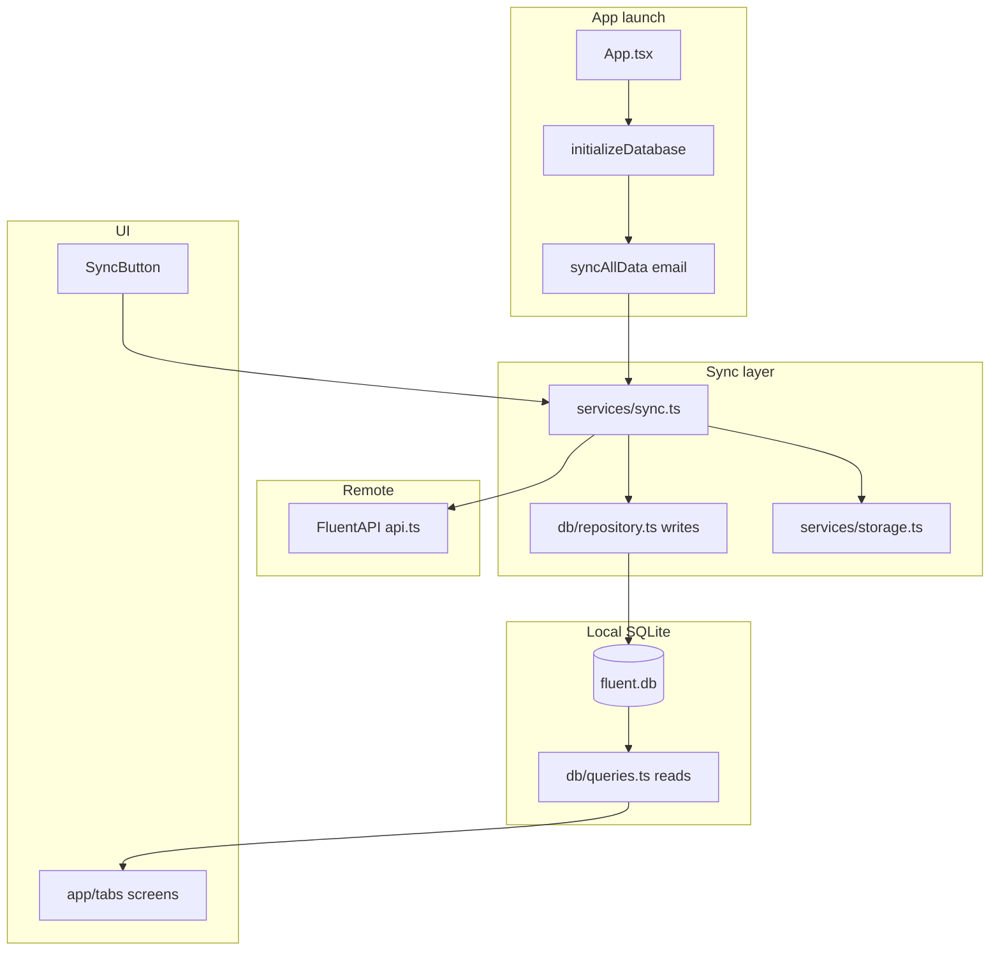

# Agent onboarding — Fluent Mobile

Quick map for Cursor agents, other coding tools, and new contributors. Verified against Expo SDK 56 + CNG (Android-only).

**Delivery judgment** (acceptance criteria, scope, abstraction budget, human device QA): root [`AGENTS.md`](../AGENTS.md).

## What this project is

**Fluent Mobile** is an offline-first React Native companion app for Bible translation recording workflows. **Android-only permanently** — no iOS app. On launch it initializes a local SQLite database, syncs data from the Fluent API, then lets users browse **projects → chapters → verses**. Recording UI exists as local state stubs; persistence to the `recordings` table is not wired yet.

## Tech stack

| Area | Choice |
|------|--------|
| Framework | Expo SDK **56**, React Native **0.85**, React **19.2.3** |
| Native | **CNG, Android-only** — `android/` generated via `npm run prebuild` (`--platform android`; not committed) |
| Language | TypeScript ~6.0 |
| Package manager | **npm** (`package-lock.json`) |
| Node | `>= 24.14.0` (README: Node 24) |
| Local DB | `@op-engineering/op-sqlite` |
| Navigation | `@react-navigation/stack` |
| Server state (installed) | `@tanstack/react-query` (minimal use today) |
| Env | `EXPO_PUBLIC_API_BASE_URL` in `.env` (Expo public env) |
| EAS | Project `b0919574-f268-4768-b3bd-7cfa5172bbab`, profiles in `eas.json` |
| Lint | ESLint 9 flat config |
| Format | Prettier 2.8 |
| Test | Jest 29 + `jest-expo` + `@testing-library/react-native` |
| CI | GitHub Actions: lint, test, typecheck, expo-doctor, expo install --check; native compile via EAS preview/release |

## Repository layout

| Path | Purpose |
|------|---------|
| [`App.tsx`](../App.tsx) | Root: DB init + initial `syncAllData`, then navigator |
| [`src/app/tabs/`](../src/app/tabs/) | Screens: `ProjectList`, `ViewProject`, `ViewChapter` |
| [`src/navigation/`](../src/navigation/) | Stack navigator |
| [`src/services/api.ts`](../src/services/api.ts) | HTTP client (`FluentAPI`) — see [api-client-standard.md](guides/api-client-standard.md) |
| [`src/services/sync.ts`](../src/services/sync.ts) | Sync orchestration, retries, KV counts |
| [`src/services/storage.ts`](../src/services/storage.ts) | KV sync state (`op-sqlite` Storage) |
| [`src/db/`](../src/db/) | Schema, init, `repository` (writes), `queries` (reads), singleton |
| [`src/types/`](../src/types/) | API, DB, navigation, env types |
| [`src/components/ui/`](../src/components/ui/) | Shared UI (`SyncButton`) |
| [`src/utils/logger.ts`](../src/utils/logger.ts) | Tagged logging |
| [`app.config.ts`](../app.config.ts) | Expo config, EAS project ID, config plugins |
| [`eas.json`](../eas.json) | EAS build/submit profiles (Android only) |
| [`.eas/workflows/`](../.eas/workflows/) | EAS release workflows (tag-triggered production builds) |
| [`plugins/`](../plugins/) | Custom config plugins (e.g. RNScreens fragment factory) |
| [`assets/`](../assets/) | App icon, adaptive icon, bootsplash source assets |
| [`.github/workflows/`](../.github/workflows/) | CI + tag version sync (`eas-build.yml`) |
| [`.github/dependabot.yml`](../.github/dependabot.yml) | Weekly dependency PRs (npm + GitHub Actions) |
| [`.cursor/rules/`](../.cursor/rules/) | Cursor agent rules |
| [`docs/guides/dependabot-process.md`](guides/dependabot-process.md) | Safe Dependabot merge process |
| [`docs/guides/local-development-workflow.md`](guides/local-development-workflow.md) | Hosted dev + local Docker API paths |
| [`.cursor/commands/`](../.cursor/commands/) | Slash commands (`/create-pr`, etc.) |

## Setup

1. Node 24: `nvm use 24` (or match `engines` in `package.json`).
2. Copy env: `cp .env.example .env` — set `EXPO_PUBLIC_API_BASE_URL` (see [local development workflow](guides/local-development-workflow.md)).
3. `npm install`
4. Generate native project (first time or after config plugin changes): `npm run prebuild` (Android-only)
5. Android dev client (two terminals):

```bash
npm start
npm run android
```

Emulator API host: `10.0.2.2` in `.env.example` maps to host `localhost`.

**Expo MCP:** Authenticate before SDK/EAS work — see [`.cursor/rules/expo-mcp.mdc`](../.cursor/rules/expo-mcp.mdc).

## Commands (verified)

Run from repo root after `npm install`:

| Command | Purpose |
|---------|---------|
| `npm run lint` | ESLint (passes; 1 warning: unused `db` in `sync.ts`) |
| `npm run format:check` | Prettier on `src/**/*.{ts,tsx}` |
| `npm run format` | Prettier write (broader glob than `format:check`) |
| `npm run typecheck` | TypeScript check (`tsc --noEmit`) |
| `npm test -- --ci` | Jest (18 suites) |
| `npm run prebuild` | Regenerate `android/` from `app.config.ts` (`--platform android`) |
| `npm run android` | Build + run dev client on Android |

**Bootsplash assets:** committed under `assets/bootsplash/`. Regenerate with `--platforms=android` only (see README Step 6).

**Prebuild failures:** if `MainApplication does not exist` → `rm -rf android` then `npm run prebuild`.

**Before claiming PR-ready:** format → lint → typecheck → test (see [`.cursor/rules/commands.mdc`](../.cursor/rules/commands.mdc)).

## Production release (Android)

Tag-driven production releases — no iOS. PR previews use OTA on the `preview` channel (see below).

1. Merge release changes to `main`.
2. Tag and push: `git tag v1.0.1 && git push origin v1.0.1`
3. **GitHub Actions** (`.github/workflows/eas-build.yml`) sets `APP_VERSION_FALLBACK` in `app.config.ts` to match the tag, commits `[skip ci]`, and moves the tag.
4. **EAS Workflow** (`.eas/workflows/create-production-builds.yml`) builds Android `production` AAB and submits to Play **internal** track.

Setup and troubleshooting: [`.eas/README.md`](../.eas/README.md).

## PR preview (Android QA)

1. Add the **`preview-build`** label to the PR (uses latest git tag, or `app.config.ts` version if none).
2. Workflow and build resolution:
   - **`runtimeVersion`:** `app.config.ts` sets **`runtimeVersion: { policy: 'appVersion' }`**.
   - **`preview-build.yml`:** [`.github/workflows/preview-build.yml`](../.github/workflows/preview-build.yml) publishes a preview OTA (JS-only) or starts an Android EAS `preview` internal APK (native/config); uses [`.github/scripts/eas-resolve-android-build.sh`](../.github/scripts/eas-resolve-android-build.sh) for fingerprint match, in-progress poll, and reuse.
   - **`.fingerprintignore`:** excludes `docs/**/*` and `.github/**/*` (among other non-native paths) from EAS build fingerprint hashing.
   - **`eas.json` / production skip:** `preview` and `development` set **`EAS_USE_CACHE: "1"`**; `production` sets **`EAS_SAVE_CACHE: "1"`** and **`EAS_RESTORE_CACHE: "0"`** (save cache only, no restore). [`.eas/workflows/create-production-builds.yml`](../.eas/workflows/create-production-builds.yml) skips rebuild when fingerprint matches (`if: !needs.get_android_build.outputs.build_id`).
3. The bot comment links to **[`docs/guides/qa-preview-testing.md`](guides/qa-preview-testing.md)** for non-technical testers (Fluent preview app — **not Expo Go** or Metro dev builds).

Requires `EXPO_TOKEN` in GitHub repository secrets. Preview builds use `eas.json` profile `preview` (internal distribution, channel `preview` — no `developmentClient`; `EXPO_PUBLIC_API_BASE_URL=https://dev.api.fluent.bible`). Local `.env` keeps emulator localhost; `dev.app.fluent.bible` is the web app, not the mobile API host. Local/engineering builds use profile `development` (`developmentClient: true`).

## Architecture and data flow



**Layer rules (do not bypass):**

- **HTTP only in** `src/services/api.ts`
- **Sync orchestration only in** `src/services/sync.ts`
- **Writes** → `src/db/repository.ts` (transactions)
- **Reads** → `src/db/queries.ts`
- **DB handle** → `setDatabase` / `getDatabase` in `src/db/db.ts` — must run after `initializeDatabase()`

Sync order in `syncAllData`: user → master data (languages, books, bibles) → projects → chapter assignments → bible texts.

Auth: email/password via `FluentAPI.signIn`; authenticated API calls use `Authorization: Bearer <token>` from keychain. User email for sync comes from KV (`getUserEmailSync`).

## Coding conventions

- **Logging:** `const log = logger.create('ComponentName')` — no raw `console` (ESLint); exception: `src/utils/logger.ts`, tests.
- **Env:** `EXPO_PUBLIC_API_BASE_URL` in `.env`; validated in `src/config/apiBaseUrl.ts` — never commit `.env`. ESLint blocks direct `process.env` reads and legacy imports (`@env`, `react-native-fs`, `react-native-keychain`, Simform waveform) outside the config layer.
- **Types:** API shapes in `src/types/api/`, DB in `src/types/db/`, navigation in `src/types/navigation/`.
- **Prettier:** single quotes, trailing commas, `arrowParens: 'avoid'`.
- **Styles:** shared patterns in `src/app/appStyles.ts`; screen-local `StyleSheet` where needed.
- **SVG:** import as React components (Metro SVG transformer).

Keep changes **small and scoped** — avoid drive-by refactors.

## Testing strategy

- **Unit:** Jest + Testing Library; mocks for native modules in [`__tests__/App.test.tsx`](../__tests__/App.test.tsx).
- **Expo mocks:** [`src/test/mocks/`](../src/test/mocks/) — global `moduleNameMapper` in `jest.config.cjs` for `expo-secure-store`, `expo-file-system`, `expo-audio`.
- **Colocated:** `src/utils/logger.test.ts`, `src/services/fluent-api.test.ts`.
- **Live API test:** `fluent-api.test.ts` is **skipped by default**; opt in with `RUN_LIVE_API_TESTS=1 npm test -- fluent-api.test.ts`.
- **No E2E** in this repo yet.

When adding features: mock `op-sqlite`, navigation, and sync in screen tests following existing patterns. Reset shared Expo mocks in `beforeEach` when mutating secure-store/file-system state.

## Common tasks

| Task | Start here |
|------|------------|
| New screen | `src/app/tabs/`, register in `AppNavigator.tsx`, extend `RootStackParamList` |
| New API endpoint | `FluentAPI` in `api.ts`, then `sync.ts` step + `repository.ts` |
| New table / column | `schema.ts` → repository inserts → queries → types |
| Manual re-sync | `SyncButton` → `syncAllData` |
| PR workflow | `/create-pr-branch`, `/generate-pr-description`, `/create-pr` (see `.cursor/commands/`) |

## Risk areas (change carefully)

| Area | Risk |
|------|------|
| `src/db/schema.ts` + `migrations.ts` | Baseline DDL + versioned `user_version` migrations |
| `sync.ts` module-level `getDatabase()` | Dead import at line 24; calling `getDatabase()` before init throws |
| `fluent-api.test.ts` | Skipped in CI; opt-in live network via `RUN_LIVE_API_TESTS=1` |
| `format` vs `format:check` | Different glob scopes — CI only checks `src/**` |
| Native folders | `android/` is gitignored CNG output — customize via `app.config.ts` + plugins. No iOS project. |

## Open questions / TODOs

- [ ] Remove unused `const db = getDatabase()` in `sync.ts:24`
- [x] Dependabot reviewers: `eten-tech-foundation/fluent-admin`
- [x] Mock or gate `fluent-api.test.ts` for offline CI
- [ ] Align `format:check` glob with `format` or document intentionally narrow check
- [ ] Wire `recordings` table to actual audio capture/upload

## Related docs

- Human setup: [README.md](../README.md)
- Agent delivery guardrails: [`AGENTS.md`](../AGENTS.md)
- Issue tracking (GitHub Issues): [issue-tracking.md](issue-tracking.md)
- CI inventory: [ci.md](ci.md)
- Cursor rules: [`.cursor/rules/`](../.cursor/rules/) — **Android-only:** [android-only.mdc](../.cursor/rules/android-only.mdc)
- Dependabot: [guides/dependabot-process.md](guides/dependabot-process.md) — use with `.cursor/rules/dependabot-workflow.mdc`
- PR template: [`.cursor/templates/pr-template.md`](../.cursor/templates/pr-template.md)
- Slash commands: `/onboard`, `/dep-bump`, `/create-pr-branch`, `/create-pr`, `/handle-dependabot` (see [`.cursor/commands/`](../.cursor/commands/))
- Hot-path notes: [src/services/AGENTS.md](../src/services/AGENTS.md), [src/db/AGENTS.md](../src/db/AGENTS.md)
