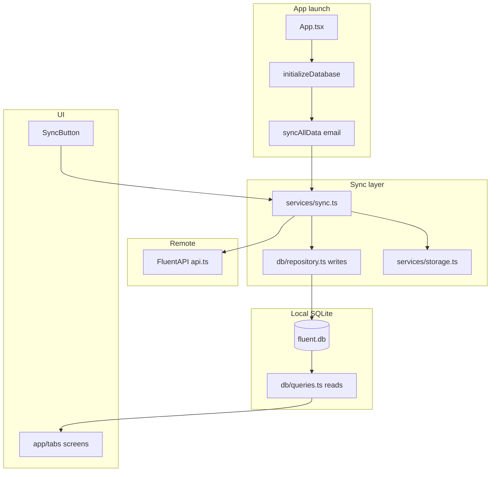

# Agent onboarding — Fluent Mobile

Quick map for Cursor agents and new contributors. Verified against this repo on branch `mrace/chore/add-cursorai-rules`.

## What this project is

**Fluent Mobile** is an offline-first React Native companion app for Bible translation recording workflows. On launch it initializes a local SQLite database, syncs data from the Fluent API, then lets users browse **projects → chapters → verses**. Recording UI exists as local state stubs; persistence to the `recordings` table is not wired yet.

## Tech stack

| Area | Choice |
|------|--------|
| Framework | React Native `0.84.1`, React `19.2.3` |
| Language | TypeScript `5.8` |
| Package manager | **npm** (`package-lock.json`) |
| Node | `>= 24.14.0` (README: Node 24) |
| Local DB | `@op-engineering/op-sqlite` |
| Navigation | `@react-navigation/stack` |
| Server state (installed) | `@tanstack/react-query` (minimal use today) |
| Env | `react-native-dotenv` → `@env` |
| Lint | ESLint 9 flat config |
| Format | Prettier 2.8 |
| Test | Jest 29 + `@testing-library/react-native` |
| CI | GitHub Actions: lint, test, Android debug build |

## Repository layout

| Path | Purpose |
|------|---------|
| [`App.tsx`](../App.tsx) | Root: DB init + initial `syncAllData`, then navigator |
| [`src/app/tabs/`](../src/app/tabs/) | Screens: `ProjectList`, `ViewProject`, `ViewChapter` |
| [`src/navigation/`](../src/navigation/) | Stack navigator |
| [`src/services/api.ts`](../src/services/api.ts) | HTTP client (`FluentAPI`) |
| [`src/services/sync.ts`](../src/services/sync.ts) | Sync orchestration, retries, KV counts |
| [`src/services/storage.ts`](../src/services/storage.ts) | KV sync state (`op-sqlite` Storage) |
| [`src/db/`](../src/db/) | Schema, init, `repository` (writes), `queries` (reads), singleton |
| [`src/types/`](../src/types/) | API, DB, navigation, env types |
| [`src/components/ui/`](../src/components/ui/) | Shared UI (`SyncButton`) |
| [`src/utils/logger.ts`](../src/utils/logger.ts) | Tagged logging |
| [`android/`](../android/) | Native Android project |
| [`.github/workflows/`](../.github/workflows/) | CI |
| [`.github/dependabot.yml`](../.github/dependabot.yml) | Weekly dependency PRs (npm + GitHub Actions) |
| [`.cursor/rules/`](../.cursor/rules/) | Cursor agent rules |
| [`docs/guides/dependabot-process.md`](guides/dependabot-process.md) | Safe Dependabot merge process |
| [`.cursor/commands/`](../.cursor/commands/) | Slash commands (`/create-pr`, etc.) |

## Setup

1. Node 24: `nvm use 24` (or match `engines` in `package.json`).
2. Copy env: `cp .env.example .env` — set `API_BASE_URL`, `FLUENT_USER_EMAIL`.
3. `npm install`
4. Android: Metro + app (two terminals):

```bash
npm start
npm run android
```

Emulator API host: `10.0.2.2` in `.env.example` maps to host `localhost`.

## Commands (verified)

Run from repo root after `npm install`:

| Command | Purpose |
|---------|---------|
| `npm run lint` | ESLint (passes; 1 warning: unused `db` in `sync.ts`) |
| `npm run format:check` | Prettier on `src/**/*.{ts,tsx}` |
| `npm run format` | Prettier write (broader glob than `format:check`) |
| `npm run typecheck` | TypeScript check (`tsc --noEmit`) |
| `FLUENT_USER_EMAIL=test@example.com npm test -- --ci` | Jest (3 suites, 7 tests) |
| `npm run android` | Run on Android device/emulator |

**Before claiming PR-ready:** format → lint → typecheck → test (see [`.cursor/rules/commands.mdc`](../.cursor/rules/commands.mdc)).

## Architecture and data flow



**Layer rules (do not bypass):**

- **HTTP only in** `src/services/api.ts`
- **Sync orchestration only in** `src/services/sync.ts`
- **Writes** → `src/db/repository.ts` (transactions)
- **Reads** → `src/db/queries.ts`
- **DB handle** → `setDatabase` / `getDatabase` in `src/db/db.ts` — must run after `initializeDatabase()`

Sync order in `syncAllData`: user → master data (languages, books, bibles) → projects → chapter assignments → bible texts.

Auth today: `x-user-email` header from `FLUENT_USER_EMAIL` / stored KV email — no OAuth in app yet.

## Coding conventions

- **Logging:** `const log = logger.create('ComponentName')` — no raw `console` (ESLint); exception: `src/utils/logger.ts`, tests.
- **Env:** `import { API_BASE_URL, FLUENT_USER_EMAIL } from '@env'` — never commit `.env`.
- **Types:** API shapes in `src/types/api/`, DB in `src/types/db/`, navigation in `src/types/navigation/`.
- **Prettier:** single quotes, trailing commas, `arrowParens: 'avoid'`.
- **Styles:** shared patterns in `src/app/appStyles.ts`; screen-local `StyleSheet` where needed.
- **SVG:** import as React components (Metro SVG transformer).

Keep changes **small and scoped** — avoid drive-by refactors.

## Testing strategy

- **Unit:** Jest + Testing Library; mocks for native modules in [`__tests__/App.test.tsx`](../__tests__/App.test.tsx).
- **Colocated:** `src/utils/logger.test.ts`, `src/services/fluent-api.test.ts`.
- **Integration test caveat:** `fluent-api.test.ts` hits `https://dev.api.fluent.bible` — can fail offline; CI may need network.
- **No E2E** in this repo yet.

When adding features: mock `op-sqlite`, navigation, and sync in screen tests following existing patterns.

## Common tasks

| Task | Start here |
|------|------------|
| New screen | `src/app/tabs/`, register in `AppNavigator.tsx`, extend `RootStackParamList` |
| New API endpoint | `FluentAPI` in `api.ts`, then `sync.ts` step + `repository.ts` |
| New table / column | `schema.ts` → repository inserts → queries → types |
| Manual re-sync | `SyncButton` → `syncAllData` |
| PR workflow | `/create-pr-branch`, `/generate-pr-description`, `/create-pr` (see `.cursor/commands/`) |

## Risk areas (change carefully)

| Area | Risk |
|------|------|
| `src/db/schema.ts` | No migrations yet — schema changes affect existing installs |
| `sync.ts` module-level `getDatabase()` | Dead import at line 24; calling `getDatabase()` before init throws |
| `fluent-api.test.ts` | Live network dependency |
| `format` vs `format:check` | Different glob scopes — CI only checks `src/**` |
| Native folders | `android/` ignored by ESLint — validate builds locally or via CI |

## Open questions / TODOs

- [ ] Remove unused `const db = getDatabase()` in `sync.ts:24`
- [ ] Confirm `teamgloo/mobile-team` is correct for Dependabot reviewers (used in `.github/dependabot.yml`)
- [ ] Mock or gate `fluent-api.test.ts` for offline CI
- [ ] Align `format:check` glob with `format` or document intentionally narrow check
- [ ] Wire `recordings` table to actual audio capture/upload

## Related docs

- Human setup: [README.md](../README.md)
- Cursor rules: [`.cursor/rules/`](../.cursor/rules/)
- Dependabot: [guides/dependabot-process.md](guides/dependabot-process.md) — use with `.cursor/rules/dependabot-workflow.mdc`
- PR template: [`.cursor/templates/pr-template.md`](../.cursor/templates/pr-template.md)
