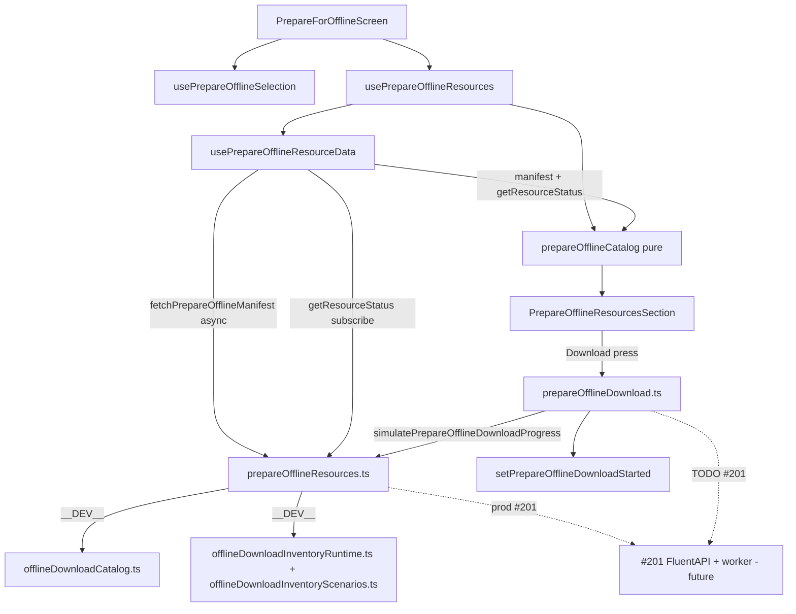

# Issue #51 — Prepare for Offline Resource Download (UI slice)

Local implementation plan (Cursor agent).  
**Saved:** 2026-07-30 · **Updated:** 2026-08-03 (service layer + fetch hook)  
**GitHub:** https://github.com/eten-tech-foundation/fluent-mobile/issues/51  
**Assignee (snapshot):** JonathanSeehagen · **Sub-issue:** [#201](https://github.com/eten-tech-foundation/fluent-mobile/issues/201) (download queue + worker)  
**Pre-PR checklist:** [`issue-51-pr-verification-guide.md`](./issue-51-pr-verification-guide.md)

Before coding, confirm the issue is still **In Progress (Dev)** / **Dev Ready** on [Project 4 → Fluent Mobile Board](https://github.com/orgs/eten-tech-foundation/projects/4/views/9).

**Scope choice:** #51 UI only — enqueue/worker deferred to #201.

**Authority:** [#51 issue text](https://github.com/eten-tech-foundation/fluent-mobile/issues/51) defines structure and behavior. Product print/mockup is a **visual helper** for row styling, tier headers, icons, and the **expanded Customize** panel only.

**Rules:** [`AGENTS.md`](../../AGENTS.md), [`CLAUDE.md`](../../CLAUDE.md), [`README.md`](../../README.md), [`.cursor/rules/`](../../.cursor/rules/).

---

## Implementation todos

| ID | Task | Status |
|----|------|--------|
| types-catalog | Add prepareOffline resource types + buildPrepareOfflineCatalog with unit tests | **done** |
| service-layer | Add prepareOfflineResources service (simulated fetch) + usePrepareOfflineResourceData hook; isolate mocks | **done** |
| enqueue-stub | Add formatByteSize + prepareOfflineDownload.enqueue stub (TODO #201) | **done** |
| hook | Implement usePrepareOfflineResources (deselect, totals, CTA rules, download handler) | **done** |
| ui-section | Build summary + CustomizeDownloadAccordion + totals + Download button | **done** |
| wire-screen | Wire into PrepareForOfflineScreen + extend tests; call setPrepareOfflineDownloadStarted | **done** |
| mock-qa | Dev mock inventory scenarios + cumulative tier rule + download simulation | **done** |
| ui-polish | Summary leading icons; Customize lock/checkbox rules; completed vs in-flight | **done** |
| pr-ci | Run format/lint/typecheck/test; open PR from template with #201/#52 follow-ups | **pending** |
| human-qa | Android device pass on Prepare for Offline flows (mock scenarios) | **pending** |

---

## Problem

[#51](https://github.com/eten-tech-foundation/fluent-mobile/issues/51) completes the Prepare for Offline screen below chapter selection ([#50](https://github.com/eten-tech-foundation/fluent-mobile/issues/50), merged). Translators must see **what will download**, optionally opt out of Tier 2/3 resources, see a **live total size**, and tap **Download** to start a tier-ordered session.



**Key design (2026-08-03):** Production code does **not** import `src/mocks/prepareOffline/` directly. Mocks are behind `prepareOfflineResources.ts`, which simulates network fetch today and becomes the FluentAPI adapter in #201.

---

## Scope

### In (#51)

| Deliverable | Detail |
|-------------|--------|
| Resource model + catalog builder | Tier 1/2/3 items (text/audio), grouped by resource name, byte sizes — **pure** builder (manifest + status injected) |
| Data access layer | `prepareOfflineResources.ts` + `usePrepareOfflineResourceData` — async manifest fetch, inventory status, subscription |
| Resources UI | Summary (read-only) + collapsed Customize + Total + Download (issue order) |
| Session-only deselect | Tier 2/3 toggles reset on project/user session change |
| CTA rules | Unassigned: disabled until `selectedCount >= 1`; enabled when `pendingBytes > 0` |
| Download start | `setPrepareOfflineDownloadStarted(userId, projectId)` + enqueue stub |
| Dev mock QA | Named inventory scenarios + cumulative tier rule + tier-ordered sim (isolated under service) |
| Tests | Catalog math, tier lock, customize lock rules, scenarios, CTA, screen integration, async hook |

### Out (other tickets)

| Ticket | Owns |
|--------|------|
| **#201** | FluentAPI manifest/inventory; SQLite queue; worker; filesystem writes; real progress |
| **#52** | Pause / Resume / Cancel controls + per-item progress rings after download starts |
| **#147** | Sync screen Downloads section (reads queue) |
| **#53** | Storage management / delete inventory |
| fluent-api | Resource manifest contract (open question on #51) |

**Delivery note ([`AGENTS.md`](../../AGENTS.md)):** Progress rings and Pause/Resume/Cancel are **#52**; real downloads are **#201**. PR Follow-ups must link both if AC items are waived at ticket level.

---

## Architecture

| Layer | Path | Notes |
|-------|------|-------|
| Types | `src/types/prepareOffline/types.ts` | Resource item, catalog, manifest entry shapes |
| Pure logic | `src/utils/prepareOfflineCatalog.ts` | Catalog build, totals, lock rules — **no mock imports**; receives `manifest` + `getResourceStatus` |
| Resource ids | `src/utils/prepareOfflineResourceId.ts` | `manifestEntryToResourceId`, `kindLabel` (shared by catalog + mocks) |
| Format | `src/utils/formatByteSize.ts` | Human-readable MB labels |
| **Data service** | `src/services/prepareOfflineResources.ts` | **Only production file that imports mocks.** `fetchPrepareOfflineManifest`, `getPrepareOfflineResourceStatus`, subscription, sim progress |
| Download service | `src/services/prepareOfflineDownload.ts` | `enqueuePrepareOfflineDownload()` — calls service for dev sim |
| Fetch hook | `src/hooks/usePrepareOfflineResourceData.ts` | Async manifest load + inventory subscription |
| Resources hook | `src/hooks/usePrepareOfflineResources.ts` | Catalog, deselects, totals, CTA, download handler |
| Mock manifest | `src/mocks/prepareOffline/offlineDownloadCatalog.ts` | Static catalog until fluent-api (#201) |
| Mock scenarios | `src/mocks/prepareOffline/offlineDownloadInventoryScenarios.ts` | **Switch scenario here** (`DEFAULT_PREPARE_OFFLINE_MOCK_INVENTORY_SCENARIO`) |
| Mock inventory | `src/mocks/prepareOffline/offlineDownloadInventoryRuntime.ts` | Runtime overrides + cumulative normalize + download sim |
| Mock barrel | `src/mocks/prepareOffline/index.ts` | Re-exports; used by service + tests only |
| UI | `src/app/prepare-offline/*` | Section, summary, customize, rows — **no mock imports** |
| Screen | `src/app/screens/PrepareForOfflineScreen.tsx` | Wires selection + resources hook |

**Removed:** `src/config/prepareOfflineMock.ts` — `__DEV__` gate lives inside `prepareOfflineResources.ts`.

**No** generic queue framework. **One** enqueue function for #201 to implement. **One** data service for #201 to extend.

### Service API (stable for #201)

| Function | Dev today | #201 |
|----------|-----------|------|
| `fetchPrepareOfflineManifest(projectId)` | Returns mock manifest (async) | FluentAPI GET manifest |
| `getPrepareOfflineResourceStatus(projectId, id)` | Mock inventory lookup | SQLite/filesystem repo |
| `subscribePrepareOfflineInventory(listener)` | Mock pub/sub | Queue/worker events |
| `clearPrepareOfflineSessionInventory()` | Clears mock runtime overrides | No-op or session reset |
| `getDefaultPrepareOfflinePackageDeselects()` | Scenario-based Tier 2/3 deselects | Empty Set (all selected) |
| `simulatePrepareOfflineDownloadProgress(projectId, ids)` | Mock worker (~2.5s/item) | Removed — real worker |

### Catalog builder input (pure)

```typescript
buildPrepareOfflineCatalog({
  manifest: PrepareOfflineResourceManifestEntry[],
  getResourceStatus: (resourceId: string) => PrepareOfflineResourceStatus,
  chapters,
  selectedIds,
})
```

---

## Implemented behavior (2026-08-03)

### Resource catalog (mock until API)

1. `usePrepareOfflineResourceData` fetches manifest via service (async).
2. `usePrepareOfflineResources` builds catalog from manifest + `getResourceStatus` + selected chapters.
3. **Tier 1 — REQUIRED:** Source Bible Text + Audio (chapter-scoped bytes).
4. **Tier 2 — RECOMMENDED:** Translation Words, Translation Notes.
5. **Tier 3 — OPTIONAL:** Bible Commentary, Reference images, Alternate translations.
6. Status per item: `completed | selected | available | downloading` (from service → mock inventory in dev).
7. Empty `selectedIds` or empty manifest → empty catalog, disabled CTA.

**~1 chapter selected (Genesis 1):** Tier 1 ≈ 144 MB · Tier 2 ≈ 108 MB · Tier 3 ≈ 66 MB · **All ≈ 318 MB**.

### Two catalogs in the hook

| Prop | Source | Used for |
|------|--------|----------|
| `catalog` | Full manifest for selected chapters | Customize accordion (all tiers) |
| `effectiveCatalog` | `catalog` minus session deselects | **Resources to download** summary |

### Selection + size math

| Row | Meaning |
|-----|---------|
| **Total download** | Sum of **effective** set (Tier 1 + selected Tier 2/3). Includes completed on-device items. |
| **Download button** | **Pending bytes only** — items not `completed`. Label: `Download X MB` or `All on device`. |

- `deselectedItemIds` resets per session (`projectId:userId` key change), seeded from service `getDefaultPrepareOfflinePackageDeselects()`.
- Default package: all Tier 2/3 selected except scenario-specific exclusions (see mock scenarios).

### Summary row icons (leading column, before label)

| Status | Icon |
|--------|------|
| `completed` | Green `CircleCheck` |
| `downloading` | Blue `Download` |
| `selected` / `available` (pending) | Gray `Download` |
| Deselected | Hidden from summary |

### Customize row controls

| Situation | Leading control | Interactive? |
|-----------|-----------------|--------------|
| Tier 1 (required) | 🔒 Lock | No |
| Tier 2/3 **`completed`** | ☑ checked checkbox | No — already on device |
| Tier 2/3 **`downloading`** | ☑ checkbox | **Yes** — can opt out of in-flight item |
| Tier 2/3 **`selected`** (pending) | ☑ / ☐ checkbox | Yes |

**Product rule encoded:** only **`completed`** items are customize-locked (plus Tier 1 lock). In-flight downloads remain opt-out-able per #51 Customize intent.

### Download button

- Full-width primary CTA: `Download {formatByteSize(pendingBytes)}`
- Disabled when: no catalog, unassigned + no chapters, `pendingBytes === 0`
- On press: `setPrepareOfflineDownloadStarted` + `enqueuePrepareOfflineDownload` + `downloadStarted` local state
- After press: placeholder *"Download started — pause and cancel controls coming in #52."*
- Dev: service simulates worker — advances items ~2.5s each (downloading → completed)

---

## Mock inventory — cumulative tier model

**Rule:** Tier N can only be `completed` or `downloading` when **every** item in tiers 1…N−1 is `completed`. Enforced by `normalizeCumulativeTierInventory()` on scenario build and on every status read.

**Removed invalid edge cases:**

| Removed | Why |
|---------|-----|
| `tier2` | Tier 2 on device without Tier 1 |
| `tier1-tier3` | Tier 3 on device while Tier 2 skipped |

### Valid dev scenarios

Switch in [`src/mocks/prepareOffline/offlineDownloadInventoryScenarios.ts`](../../src/mocks/prepareOffline/offlineDownloadInventoryScenarios.ts):

```typescript
export const DEFAULT_PREPARE_OFFLINE_MOCK_INVENTORY_SCENARIO = 'fresh';
```

| Scenario | On device | Package default | Typical button |
|----------|-----------|-----------------|----------------|
| `fresh` | Nothing | All tiers | Download ~318 MB |
| `tier1` | Tier 1 ✓ | Tier 1 only | All on device |
| `tier1-tier2` | Tier 1 + 2 ✓ | Tier 1 + 2 (Tier 3 **out**) | All on device |
| `tier1-tier2-tier3-pending` | Tier 1 + 2 ✓ | All tiers (Tier 3 **in**) | Download ~66 MB |
| `all` | All ✓ | All tiers | All on device |
| `mixed` | Tier 1 ✓; Tier 2 partial (Words audio downloading); Tier 3 pending | All tiers | Download partial |

Reload app after changing the constant.

### Mock file relationships

| File | Role | Works with |
|------|------|------------|
| `offlineDownloadCatalog.ts` | What **can** download (static catalog, sizes, tiers) | `offlineDownloadInventoryScenarios.ts` (ids), `offlineDownloadInventoryRuntime.ts` (ids), service fetch |
| `offlineDownloadInventoryScenarios.ts` | Preset **on-device** states for QA | `offlineDownloadCatalog.ts` (resource ids), `offlineDownloadInventoryRuntime.ts` (seeds runtime) |
| `offlineDownloadInventoryRuntime.ts` | In-memory runtime + pub/sub + download simulation | `offlineDownloadInventoryScenarios.ts` (base state), service (status reads) |

---

## UI layout (as built)

```
[ Assigned chapters (N) ▼ ]     ← #50

RESOURCES TO DOWNLOAD

┌─ Resource summary (read-only, effectiveCatalog) ──┐
│ [icon] Text    8 MB                               │
│ [icon] Audio   136 MB                             │
└───────────────────────────────────────────────────┘

▸ Customize download  (collapsed by default)

  TIER 1 — REQUIRED 🔒
  TIER 2 — RECOMMENDED
  TIER 3 — OPTIONAL

Total download                    318 MB
[  ⬇  Download 66 MB  ]
```

---

## Files created / edited

| Action | Path |
|--------|------|
| Extend | `src/types/prepareOffline/types.ts` |
| Create | `src/utils/prepareOfflineCatalog.ts` + test |
| Create | `src/utils/prepareOfflineResourceId.ts` |
| Create | `src/utils/formatByteSize.ts` |
| Create | `src/services/prepareOfflineResources.ts` |
| Create | `src/services/prepareOfflineDownload.ts` |
| Create | `src/hooks/usePrepareOfflineResourceData.ts` |
| Create | `src/hooks/usePrepareOfflineResources.ts` + test |
| Create | `src/mocks/prepareOffline/offlineDownloadCatalog.ts` |
| Create | `src/mocks/prepareOffline/offlineDownloadInventoryScenarios.ts` + test |
| Create | `src/mocks/prepareOffline/offlineDownloadInventoryRuntime.ts` + test |
| Create | `src/mocks/prepareOffline/index.ts` |
| Create | `src/app/prepare-offline/PrepareOfflineResourcesSection.tsx` + test |
| Create | `src/app/prepare-offline/PrepareOfflineResourceSummary.tsx` |
| Create | `src/app/prepare-offline/CustomizeDownloadAccordion.tsx` |
| Create | `src/app/prepare-offline/ResourceTierSection.tsx` |
| Create | `src/app/prepare-offline/ResourceItemRow.tsx` + test |
| Create | `src/app/prepare-offline/SelectionCheckbox.tsx` |
| Edit | `src/hooks/usePrepareOfflineSelection.ts` — export `chapters` |
| Edit | `src/app/screens/PrepareForOfflineScreen.tsx` + test |
| Create | `docs/plans/issue-51-pr-verification-guide.md` |

**Removed:** `src/config/prepareOfflineMock.ts` (replaced by service-layer `__DEV__` gate).

---

## Tests (implemented)

| File | Cases |
|------|-------|
| `prepareOfflineCatalog.test.ts` | Tier taxonomy; total vs pending; deselect; customize lock; manifest + getResourceStatus injection |
| `usePrepareOfflineResources.test.ts` | CTA rules; session reset; scenario deselects; async catalog via data hook |
| `PrepareOfflineResourcesSection.test.tsx` | Summary; customize expand; completed tier-2 lock in customize |
| `ResourceItemRow.test.tsx` | Leading summary icons; tier lock; on-device checkbox; downloading editable |
| `scenarios.test.ts` | Cumulative scenarios; normalize rule; package deselects |
| `inventory.test.ts` | Fresh default; mixed statuses; download simulation |
| `PrepareForOfflineScreen.test.tsx` | Resources visible; Download → storage + enqueue |

---

## Remaining work (before PR)

1. **Human Android QA** — run all six mock scenarios on device; confirm icons, totals, button, customize toggles, download sim.
2. **CI gates** — `format:check` → `lint` → `typecheck` → `npm test -- --ci`.
3. **PR** — branch `jonathanseehagen/feature/51-prepare-offline-resource-download`, title `[#51]: Build Prepare for Offline resource download UI`, body from [`.cursor/templates/pr-template.md`](../../.cursor/templates/pr-template.md).
4. **Follow-ups in PR** — #201 (implement service internals + worker), #52 (pause/cancel/progress rings), fluent-api manifest contract.

See [`issue-51-pr-verification-guide.md`](./issue-51-pr-verification-guide.md) for file-by-file review order.

### Not in #51 (defer)

- Progress rings on summary rows (#52 / #201)
- Real filesystem writes / SQLite inventory (#201)
- FluentAPI manifest/inventory inside `prepareOfflineResources.ts` (#201)
- Persist customize deselects across sessions (issue says reset each session — **implemented**)

---

## Delivery workflow

1. Branch: `jonathanseehagen/feature/51-prepare-offline-resource-download`
2. PR title: `[#51]: Build Prepare for Offline resource download UI`
3. PR body: [`.cursor/templates/pr-template.md`](../../.cursor/templates/pr-template.md) — include mock QA table + #201/#52 waivers
4. CI: `format:check` → `lint` → `typecheck` → `npm test -- --ci`
5. Board: **In PR Review** when PR opens

---

## Risks

| Risk | Mitigation |
|------|------------|
| No fluent-api manifest | Mock behind service + PR Follow-up #201/API |
| #52 controls blocked | Placeholder text + waiver linking #52 |
| #201 schema thrash | Thin service + enqueue contract; catalog/UI unchanged |
| Mock scenarios diverge from production | Document cumulative rule for #201 inventory writes |
| Mock leaked into production imports | Enforced: only `prepareOfflineResources.ts` imports mocks |

---

## Changelog

| Date | Change |
|------|--------|
| 2026-07-30 | Initial plan saved from Cursor (`issue_51_resources_ui_a33cb009.plan.md`) |
| 2026-07-30 | Reconciled issue (#51) vs print — summary + collapsed customize |
| 2026-08-03 | **Implementation complete (UI + mock).** Mock scenarios, cumulative tier rule, summary icons, customize lock rules, dev download simulation. |
| 2026-08-03 | **Service layer refactor.** Added `prepareOfflineResources.ts` + `usePrepareOfflineResourceData`; catalog pure (no mock imports); removed `prepareOfflineMock.ts`; added `prepareOfflineResourceId.ts`; PR verification guide. Remaining: PR + human QA. |
