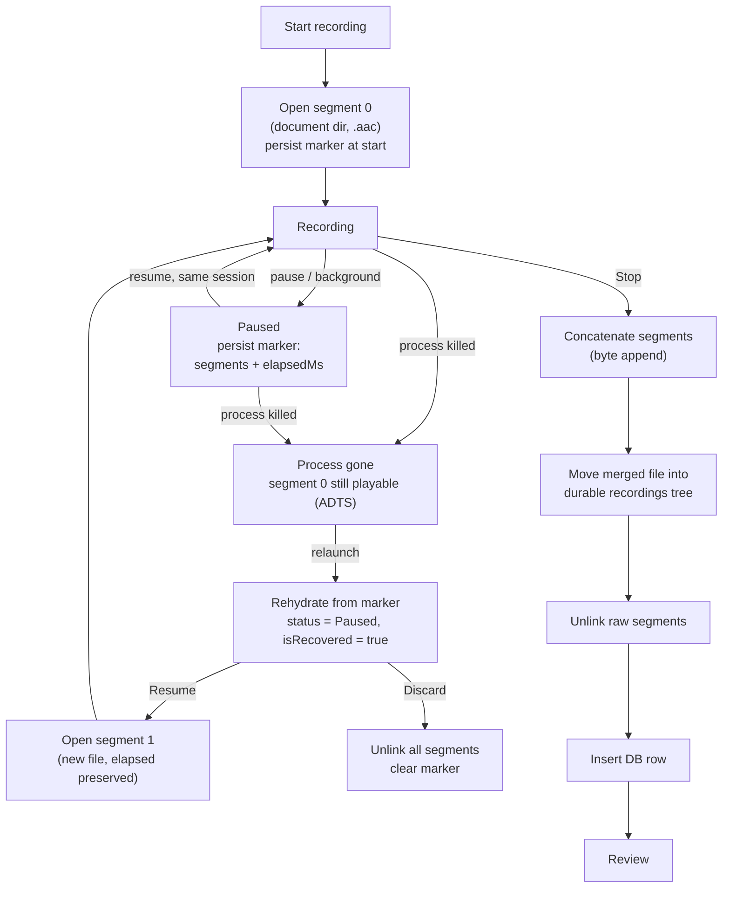

# Kill-resilient partial recordings

How Fluent Mobile keeps an in-progress verse recording recoverable — and
resumable — even when the app process is killed by the OS or by the user.

## Problem

`expo-audio`'s `HIGH_QUALITY` preset records MPEG-4 AAC (`.m4a`). An MP4/M4A
container is only valid once its `moov` atom is written, and that happens on a
clean `recorder.stop()`. If the process dies mid-recording (OS reclaim, force
stop, crash), the partial file on disk has no `moov` atom: it is **unplayable
and un-appendable**. That makes a true "resume after kill" impossible with the
default format — the bytes captured before the kill are effectively lost.

Backgrounding-without-kill was already handled separately (auto-pause on
background, guarded resume on foreground). This document covers the harder case:
the JS runtime and native recorder are gone.

## Solution

Two changes make partial takes durable:

1. **Record ADTS AAC (`.aac`) instead of `.m4a`.** ADTS is a self-framing
   bitstream — every frame carries its own header, so there is no trailing
   metadata to lose. A segment truncated by a process kill stays playable up to
   the last complete frame, and two ADTS files concatenate into one valid file
   by plain byte append.

2. **Model a take as an ordered list of segments.** Each continuous recording
   session (within one app lifetime) writes one segment. A live take is a single
   segment; resuming after a kill opens a **new** segment appended to the
   rehydrated ones. On stop, the segments are concatenated into the committed
   take.

A persisted marker (the "manifest") records the segment list, accumulated
elapsed time, and start timestamp so the take can be rehydrated on the next app
launch. The marker is written **the moment recording starts** and again on every
pause/background. Writing at start (not only on pause) is what makes a hard
task-swipe kill recoverable: such a kill can destroy the process before the
background auto-pause handler gets to run, so a pause-only marker would never
exist for the very case this is meant to cover.

## Lifecycle



## Key components

| Concern | Location |
|---|---|
| Record as ADTS AAC | `src/hooks/useRecorder.ts` — `useAudioRecorder({ extension: '.aac', android: { outputFormat: 'aac_adts', audioEncoder: 'aac' } })` |
| Segment tracking + resume-after-kill | `src/hooks/useRecorder.ts` — `segmentsRef`, `startRecordingSession()`, `continueRecordingSession()`, `resume()` |
| `isRecovered` flag (rehydrated take) | `src/hooks/useRecorder.ts` — surfaced in the hook API |
| When the marker is written | `src/hooks/useRecorder.ts` — `persistLiveMarker()` (at start and on pause) |
| Segment manifest persistence | `src/services/storage.ts` — `PausedTakeMarker.segments` |
| Find the recovered take for the home prompt | `src/services/storage.ts` — `findPausedTake()` |
| Home recovery prompt (Continue / Discard) | `src/app/screens/hooks/useRecordingRecovery.ts` |
| Concatenation | `src/services/recordingStorage.ts` — `concatenateAacSegments()` |
| Merge → move → cleanup → insert | `src/app/tabs/drafting/record/hooks/useVerseRecorder.ts` — `onCommit`, `deletePausedFiles` |
| UI (Resume / Stop / Discard + copy) | `src/app/tabs/drafting/record/components/RecordingControls.tsx` |

## Manifest shape

`PausedTakeMarker` (persisted in KV storage, keyed by `bibleTextId`):

```ts
interface PausedTakeMarker {
  bibleTextId: number;
  segments: string[]; // ordered absolute file URIs, one per session
  elapsedMs: number; // accumulated active recording time
  startedAt: string; // ISO timestamp of the first session
  sessionToken?: string; // present on live markers
  chapterAssignmentId?: number; // navigation context for the home prompt
  verseNumber?: number; // navigation context for the home prompt
}
```

## Resume-after-kill flow

0. On the home screen (after sync), `useRecordingRecovery` calls
   `findPausedTake()`. If a marker exists it forces a decision — **Continue**
   navigates to that verse's Record tab (steps below), **Discard** unlinks the
   segments and clears the marker. This is what surfaces a killed take without
   the user having to remember which verse they were on. A forced decision keeps
   at most one marker around, so a single lookup is enough.
1. On mount, `useVerseRecorder` reads the marker via `getPausedTake()`.
2. `useRecorder` rehydrates: `status = Paused`, `canResume = true`,
   `isRecovered = true`, `elapsedMs = marker.elapsedMs`, and
   `segmentsRef = marker.segments`. There is no live native session, so
   `liveSessionTokenRef` stays `null`.
3. **Resume** calls `continueRecordingSession()`: it prepares and starts a fresh
   recording (a new segment file), preserves the accumulated elapsed time and
   `startedAt`, and pushes the new segment onto `segmentsRef`.
4. **Stop** concatenates every segment, moves the merged file into the durable
   `recordings/` tree, unlinks the raw segments, and inserts the DB row.
5. **Discard** unlinks all segments and clears the marker.

## Caveats

- **Segment paths are absolute URIs.** This is simple and matches the prior
  working behavior. The tradeoff: an in-progress take would not survive a
  document-directory relocation across an app update/reinstall. It fully
  survives the primary case — a process kill within the same install.
- **On-device validation.** Concatenation assumes `expo-audio` writes each
  segment into the directory that `expo-file-system`'s `Paths.document`
  resolves to. This can't be exercised in Jest; smoke-test on a device:
  record → kill app → relaunch → resume → stop → play.
- **ADTS vs M4A quality/size.** ADTS AAC is functionally equivalent audio; the
  container difference is what buys resilience. Downstream upload/playback must
  accept `.aac`.
- **Elapsed time on kill.** The marker's `elapsedMs` is written at start (`0`)
  and refreshed on pause — not continuously while recording. A kill mid-recording
  therefore recovers the full **audio** but the recovered take's timer/committed
  duration can undercount the un-paused portion. This is an intentional
  simplification (kill recovery, not precise timing); the captured bytes are
  unaffected — resume appends a new segment and stop concatenates everything.
