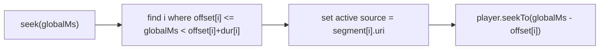

# Spike: single m4a at commit vs segment manifest + global seek (#176)

Status: kill test complete (steps 1-4 answered) + **final device test run** — a third
option (C) emerged; A vs B vs C deferred to #176 (see Decision)
Branch: `fel-cesar/spike/explore-m4a`
Time box: half a day max (per #176 discussion). Post findings on #176 before building any more native code.

## Goal

Confirm whether committed recording takes **must** be remuxed into a single seekable
`.m4a` via the native `AacRemux` module, or whether a **JS-only segment manifest with
global seek in playback** gives acceptable Review scrubbing and lets us drop the native
bridge entirely.

Three real options are now on the table (the final device test surfaced C):

- **A — ADTS segment manifest + global seek (JS only).** Keep the ordered ADTS segments and
  play them as one logical stream in a hook; seek maps a global position to
  `(segment, offset)`. No Kotlin. Open question: intra-ADTS seek accuracy.
- **B — ADTS capture + remux on commit (current branch state).** Losslessly repackage
  the merged ADTS take into a seekable `.m4a` with `MediaMuxer` on `stop()`. The remux
  module is not brute force if we genuinely need one seekable file at commit — it is just
  using an Android API JS can't reach.
- **C — m4a segment manifest + global seek (JS only, NEW).** Capture each session directly
  as `.m4a`, keep them as an ordered manifest, and play them as one logical stream with the
  same hook as A. Each segment is natively seekable (it has its own `moov`/sample table),
  so seek is accurate with **no remux module**. Trade-offs: m4a segments are **not
  JS-mergeable** (would need ffmpeg/native), and a hard kill can **occasionally** leave the
  in-flight segment corrupt (see final-test results). Emerged from the final device test.

If upload eventually needs a single file, that merge can also happen **server-side or
during sync** instead of in a native module at commit.

## Terminology (so we stay aligned)

- **Module** = native code bridged to JS (e.g. `expo-audio`, `AacRemux`). Implies Kotlin.
- **Package / dependency** = npm install.
- **Component** = UI (`RecordingWaveform`).
- **Hook / service** = logic (`useAudioPlayback`, `recordingStorage`).

Calling everything a "module" makes it sound like native code is needed when it isn't.
The #96 waveform is a **component + hook**, not a module.

## Background: why capture is ADTS, and what the remux actually solves

Capture is ADTS AAC (`.aac`), not the preset `.m4a`, on purpose
([`src/hooks/useRecorder.ts`](../../src/hooks/useRecorder.ts) recorder config):

- Classic MP4/M4A is only valid once its `moov` atom is written on a clean `stop()`. If
  the app dies mid-take, the file usually isn't playable and can't be appended to.
- ADTS is a self-framing bitstream: a killed segment stays playable, and multiple
  segments concatenate by **byte append** — that is what makes pause / resume-after-kill
  work ([`concatenateAacSegments`](../../src/services/recordingStorage.ts)).

The remux ([`AacRemux`](../../modules/aac-remux/android/src/main/java/expo/modules/aacremux/AacRemuxModule.kt)
+ [`remuxTakeToSeekableContainer`](../../src/services/recordingStorage.ts)) conflates
**two separate concerns**:

1. **Merging** a multi-segment take into one playable stream (already solved in JS by
   byte-appending ADTS).
2. **Accurate scrubbing** on a container that has no sample index — ADTS carries no
   `moov`/sample table, so ExoPlayer's absolute seek is approximate.

The manifest approach (Option A) addresses (1) without merging files at all. Whether it
also gives us (2) depends on how accurately ExoPlayer seeks **within** an ADTS segment —
that is the crux this spike measures.

Do **not** try to strip MP4 headers or byte-concatenate `.m4a` files. MP4 is a box
structure, not a header + payload like ADTS; removing bytes or joining files won't
produce a valid `.m4a`. That approach is out of scope.

## What we already know from static analysis (no device required)

Read from `expo-audio`'s own types
([`node_modules/expo-audio/build/Audio.types.d.ts`](../../node_modules/expo-audio/build/Audio.types.d.ts)):

- **Android record formats are fixed** to
  `'default' | '3gp' | 'mpeg4' | 'amrnb' | 'amrwb' | 'aac_adts' | 'mpeg2ts' | 'webm'`
  (`AndroidOutputFormat`). There is **no fragmented-MP4 (fMP4) option**, and `mpeg4` is
  classic MediaRecorder MP4 (needs a `moov` on clean `stop()`).
- The only self-framing / crash-tolerant containers exposed are `aac_adts` (what we use)
  and `mpeg2ts`. There is no single format that is both crash-safe **and** natively
  seekable through a preset.
- Supporting fMP4 (`moof`/`mdat` fragments — more crash-tolerant) would require a custom
  `AudioRecord → MediaCodec → fragmented muxer` pipeline. That is a **much larger** native
  project than the remux module, so it's ruled out for this feature.
- **Metering is available in JS**: `RecordingOptions.isMeteringEnabled` +
  `RecorderState.metering`. So the #96 live waveform is metering samples sizing bars in a
  React component — **no Kotlin, no `modules/` folder**. #96 should not be handled like
  #176: #176 needed a platform API (`MediaMuxer`); waveform rendering does not.

This resolves César's spike **steps 3 and 4** by inspection (see matrix). Steps 1-2
require a device build (kill test).

## Test matrix (César's bounded plan)

Fill the Observed column from an Android device build. Steps 3-4 are answered above by
static analysis; steps 1-2 need the kill-test toggle (see "Device eval" below).

| # | Test | Expected | Observed |
|---|------|----------|----------|
| 1 | Record with default `HIGH_QUALITY` `.m4a` preset (`mpeg4`), kill app mid-take | Partial file is **unplayable** (no `moov` written) | **Confirmed lossy on device** — only a prefix of the take is playable; audio recorded near the kill is lost (`moov` never finalized). Exact symptom (prefix-plays vs fail-to-open) may vary by device/player, but it is lossy either way. Video captured. |
| 2 | Record with our ADTS config (`aac_adts`/`.aac`), kill app mid-take | Partial file is **playable** | **Confirmed playable on device** — the full partial take plays end-to-end and is resumable (self-framing AAC frames, no central index to go stale). Video captured. |
| 3 | Does `expo-audio` expose output formats beyond `mpeg4` / `aac_adts`? | Yes but none help: `3gp`, `amrnb`, `amrwb`, `mpeg2ts`, `webm` — no fMP4; only `aac_adts`/`mpeg2ts` are crash-safe | Confirmed by types (static) |
| 4 | Does a single-format (crash-safe + seekable) path exist through a preset? | No. fMP4 would need a custom recorder pipeline → close the "single expo-audio format" path | Confirmed by types (static) |

Additional measurements for the manifest approach (from the prototype on device). The
cross-segment / global-seek rows were answered by the **final test** below using **m4a**
segments (Option C); intra-**ADTS** seek accuracy (Option A) is the one thing still
unmeasured:

| Measurement | Target | Observed |
|-------------|--------|----------|
| Intra-ADTS seek accuracy (scrub to N%, playback resumes at ~N%) | within ~1 frame (~23ms) for CBR | _TBD (ADTS/Option A only)_ |
| Cross-segment sequential playback | no audible gap at boundary | **Pass (m4a)** — little/no perceptible gap (final test) |
| Global seek across a segment boundary (source swap) | not obviously laggy while scrubbing | **Pass (m4a)** — auto-switches segment at the correct relative offset (final test) |

## Prototype (Option A) — what was built for the spike

- [`src/hooks/useSegmentedAudioPlayback.ts`](../../src/hooks/useSegmentedAudioPlayback.ts)
  — spike hook implementing the same `UseAudioPlaybackApi` as
  [`useAudioPlayback`](../../src/hooks/useAudioPlayback.ts), over an ordered manifest
  `{ uri, durationMs }[]`:
  - `durationMs` = sum of segment durations.
  - `positionMs` = cumulative offset of the active segment + player `currentTime`.
  - `seek(globalMs)` = locate the segment by cumulative durations, switch the active
    source, then seek within it to `globalMs − offset`.
  - Advances to the next segment on `didJustFinish` for sequential playback; rewinds to
    global 0 when the last segment finishes.

Global-seek mapping:

Because it exposes the exact `UseAudioPlaybackApi` shape, it is a drop-in for
[`RecordingWaveform`](../../src/app/tabs/drafting/record/components/RecordingWaveform.tsx)
and the production single-file path is untouched (spike flag off).

### Alternative vehicle: `expo-audio` Playlist API

`expo-audio` also exposes a Playlist API (`AudioPlaylist` / `useAudioPlaylist`,
`currentIndex`, `AudioPlaylistLoopMode`). It could drive sequential segment playback
natively and might reduce the source-swap gap. Trade-off: global scrubbing still has to
switch track + seek within it, and per-track status mapping is coarser. Evaluate on
device; note whichever the single-player-swap approach or the playlist gives the smoother
scrub.

## Device eval scaffolding (throwaway, spike only)

A reactive flag store in [`src/spike/m4aSpike.ts`](../../src/spike/m4aSpike.ts) (all default
`false`) is toggled at runtime from an on-screen debug panel
([`SpikeFlagSwitcher`](../../src/spike/SpikeFlagSwitcher.tsx)) rendered at the top of the
Record screen — so the experiments can be flipped on a device without rebuilding. The panel
is dev-only (hidden when `__DEV__` is false). Flag values are persisted to the app's
op-sqlite KV store (`spike_flags_176`) and rehydrated at startup, so they survive a
force-kill — the armed experiment stays on across the relaunch used to test crash recovery.
Delete the `src/spike/` folder with the branch's decision.

- **Record .m4a** (`recordM4a`) — capture with the `HIGH_QUALITY` `.m4a` (`mpeg4`) preset
  instead of ADTS, to run the step-1 kill test. Toggle it *before* starting a take.
- **Keep manifest** (`keepSegmentManifest`) — on commit, keep the raw captured segments
  (ADTS *or* m4a) and write a JSON `{ uri, durationMs }[]` manifest (skip the merge +
  native remux) so the segmented hook can be exercised on a real multi-segment kill-resume
  take. Each segment's duration is probed by container (MP4 `moov` for m4a, ADTS frames
  otherwise); segments that fail to probe (a moov-less m4a from a mid-record kill) are
  dropped.
- **Segment playback** (`segmentPlayback`) — Review playback in `RecordTab` uses
  `useSegmentedAudioPlayback` (fed by the manifest) instead of the recorder's built-in
  single-file playback.
- **Skip m4a remux** (`skipRemux`) — on commit, merge the segments but commit the result
  as a single ADTS `.aac` (skip `remuxTakeToSeekableContainer`) instead of a seekable
  `.m4a`. Isolates whether the native remux is actually needed for seek. No effect when
  **Keep manifest** is on (that path never merges/remuxes).

Below the Review controls, a dev-only
[`SpikeSegmentList`](../../src/spike/SpikeSegmentList.tsx) shows the segments backing the
current playback: a multi-segment manifest lists every segment (with the currently-playing
row highlighted so cross-boundary advancement is visible), while the production single-file
path shows exactly one row.

A dev-only [`SpikeClearRecordingsButton`](../../src/spike/SpikeClearRecordingsButton.tsx)
(under the flag switcher) wipes ALL recordings — every `recordings` row, the on-disk
recordings tree, and any paused-take markers plus their partial files — via
`clearAllRecordings` in `m4aSpike.ts`. It resets device state between kill-test /
segment-playback runs (reopen the verse afterwards to refresh the screen).

Steps 1-2 kill test:

1. Turn **Record .m4a** ON, record a take, kill the app mid-take, try to play the partial
   file → expect unplayable.
2. Turn **Record .m4a** OFF (ADTS), repeat → expect the partial is playable.

### Final test — multiple m4a as one logical stream (manifest + global seek)

Goal: prove several **independently-finalized `.m4a` files** can be played and scrubbed as a
single logical take via the manifest (no native remux, no byte-concatenation), and see
exactly what a mid-record crash costs when capture is m4a.

Flags: **Record .m4a** + **Keep manifest** + **Segment playback** all ON.

Steps:

1. Record a take and **Stop cleanly** → segment 1 is a finalized, seekable `.m4a`.
2. **Re-record** to append across sessions, *or* force-kill mid-take and relaunch: the
   recovery prompt resumes into a **new** segment. Stop cleanly.
3. Repeat once more → up to three `.m4a` files backing one take.
4. In Review, the [`SpikeSegmentList`](../../src/spike/SpikeSegmentList.tsx) lists the
   surviving segments; play through and scrub — global position/duration and cross-segment
   advancement come from the manifest, and each segment seeks natively (m4a has a sample
   table, so no remux is needed for accuracy).

How the manifest is built: on commit, `writeSpikeManifest` probes each segment's exact
duration — `.m4a`/`.mp4` via the MP4 `moov > mvhd`
([`mp4DurationMs`](../../src/services/recordingStorage.ts)), ADTS via frame walking
([`aacDurationMs`](../../src/services/recordingStorage.ts)) — and writes an ordered
`{ uri, durationMs }[]` sidecar. `useSegmentedAudioPlayback` consumes it unchanged.

Expected result / caveat (chosen model: **one file per recording session**, corrupt
segments dropped): a `.m4a` is only playable once its `moov` is written on a **clean
`stop()`**. A segment that is actively recording when the process is killed has **no
`moov`**, so its MP4 probe returns `0` and `writeSpikeManifest` **drops it** from the
manifest. So in the worst case a mid-record kill loses the in-flight chunk — the point ADTS
capture avoids. This makes the tradeoff concrete: ADTS segments always survive a crash but
need accurate intra-segment seek; m4a segments seek natively but *can* lose the in-flight
chunk on a hard kill.

### Final test — results (device)

Ran with **Record .m4a + Keep manifest + Segment playback** hard-forced on, across
multi-segment takes, killing the app **both** by swiping from Recents **and** by
`adb shell am force-stop com.eten.fluent` (system-style kill). What we actually observed:

| Measurement | Target | Observed |
|-------------|--------|----------|
| Cross-segment sequential playback (m4a → m4a) | no audible gap | **Pass** — little to no perceptible gap between segments. |
| Global seek across the whole take | resumes at ~N% of total | **Pass** — seek maps to the right segment and the correct offset within it (relative to total duration); auto-switches m4a files while scrubbing. |
| Play multiple m4a as one logical, seekable stream | works | **Pass** — the manifest + `useSegmentedAudioPlayback` play N independent `.m4a` as a single seekable take. |
| m4a integrity after a hard kill | in-flight segment corrupt | **Mostly survived, unexpectedly** — in most swipe *and* `am force-stop` runs the killed segment was still playable; **some** runs left a corrupt (moov-less) file. Not reliable. |
| Merge N m4a → one file in JS | — | **Not possible** reliably JS-only (MP4 is a box structure, not append-able); would need ffmpeg/native. |

**The unexpected part — why did most hard-killed m4a survive?** Canonically a
`MediaRecorder` MP4 is unplayable unless `moov` is written on a clean `stop()` (confirmed
by step-1 kill test and the Android docs / community reports). Yet here most killed
segments played. Best explanation, consistent with what we saw:

- expo-audio's `useAudioRecorder` holds the native recorder via `useReleasingSharedObject`,
  so activity/component teardown **releases** (and thus finalizes) the recorder. A
  **swipe-away** delivers lifecycle callbacks (our `AppState` background auto-pause runs,
  then the object is released), which frequently lets the `moov` get written before the
  process dies.
- The actual muxing runs in a **separate media-server process**, not in
  `com.eten.fluent`. `am force-stop` kills the *app* process, but the media server can
  still flush/finalize the container as it tears down the session — so the `moov` often
  lands anyway.
- Both paths are **timing- and OEM-dependent**, which is exactly why *some* runs still
  produced a corrupt file. **This must not be relied on for data safety** — treat m4a
  in-flight loss as possible, not guaranteed.

**Why it still "just worked" as a stream even when a file did corrupt:** the manifest
writer probes each segment and **drops** any that has no `moov` (probe → 0ms), so a
corrupt in-flight segment is silently excluded and the finalized segments still play as one
logical take. The failure mode degrades to "lose the last chunk," never "whole take
unplayable."

**Bottom line from the final test:** Option C (m4a segments + manifest) delivers accurate
native seek and gap-free sequential playback **without any native remux module**, and in
practice tolerated hard kills better than the theory predicted — but it cannot merge to a
single file in JS and its crash-safety is best-effort, not guaranteed (ADTS remains the
only *guaranteed* crash-safe capture).

## Risks / issues that can happen

- **Intra-ADTS seek accuracy is the real question.** A manifest does not fix per-segment
  seek precision — it only avoids merging files. `HIGH_QUALITY` is ~CBR 128 kbps, so
  ExoPlayer's byte-offset estimate may be "good enough"; a VBR stream would drift. If
  direct ADTS scrubbing is inaccurate, Option A does **not** beat the remux and we keep B.
- **Source-swap latency / audible gap** when crossing a segment boundary (both for
  sequential playback and for a seek that lands in a different segment). This is the main
  UX risk of Option A; measure it, and compare against the Playlist API.
- **The common case is a single segment.** Multi-segment takes only happen after a
  kill-resume, so Option A's added complexity buys little for most takes — for a single
  segment it degenerates to plain `useAudioPlayback`.
- **Upload may require one file.** If the backend/sync wants a single artifact, we still
  need a merge somewhere — but that can be server-side or at sync time, not necessarily a
  native remux at commit.
- **Schema / storage impact.** `recordings.local_file_path` is a single path today
  ([`src/types/db/types.ts`](../../src/types/db/types.ts)). A persisted manifest needs a
  JSON sidecar or multiple rows. Called out as scope only — not built in the spike.
- **Two audio sessions.** With the spike playback flag on, the recorder's built-in
  playback and the segmented hook both exist; only the segmented one is driven. Fine for a
  spike, but a production Option A would fold segmented playback into the recorder rather
  than run both.

## Decision

### Settled by this spike (kill test + static analysis)

- **Classic `.m4a` (`mpeg4`) capture is *not guaranteed* crash-safe.** Device kill test
  (step 1) caught the canonical failure — a mid-take kill can leave the file moov-less and
  lossy, because `MediaRecorder` only finalizes the `moov` on a clean `stop()`. The final
  test then showed the outcome is **nondeterministic**: most swipe / `am force-stop` kills
  actually *did* finalize the in-flight segment (recorder released on teardown; muxing runs
  in a separate media-server process), but some did not. So m4a in-flight loss is
  **possible but not reliable** — it can't be leaned on for data safety.
- **ADTS (`aac_adts`) capture is crash-safe.** Device kill test (step 2) confirmed the
  full partial take plays and is resumable. **ADTS capture stands.**
- **No single crash-safe + natively-seekable format exists through an `expo-audio`
  preset.** `AndroidOutputFormat` exposes no fMP4; only `aac_adts`/`mpeg2ts` are
  self-framing (steps 3-4, by type inspection). fMP4 would require a custom
  `AudioRecord → MediaCodec → fragmented muxer` pipeline — ruled out.

This closes the tech-lead-scoped spike. Findings posted on #176.

### Still open — A vs B vs C (deferred, gated on #176)

The final device test added a third option and settled the seek/boundary question **for
m4a**. Producing a seekable take is now one of three:

- **Option A — ADTS segment manifest + global seek (JS only).** Delete `modules/aac-remux`
  and the `aacRemux` service. Guaranteed crash-safe capture. **Open:** intra-ADTS seek
  accuracy (ADTS has no sample table, so ExoPlayer's absolute seek is byte-estimated) —
  still unmeasured.
- **Option B — ADTS capture + remux on commit** (keep the native `MediaMuxer` remux), or
  merge at sync/server and play a single file. Guaranteed crash-safe capture + accurate
  seek, at the cost of the native module (or a server/sync merge).
- **Option C — m4a segment manifest + global seek (JS only).** No native module; native
  accurate seek and gap-free playback confirmed on device (final test). **Costs:** m4a
  segments are not JS-mergeable (needs ffmpeg/native if a single file is ever required),
  and crash-safety of the in-flight segment is best-effort, not guaranteed.

How to choose:

- Need a **guaranteed** single seekable artifact and can afford native → **B** (or A/C +
  server-side merge).
- Want **zero native code** and accurate seek, accept multi-file storage and best-effort
  in-flight crash-safety → **C** (proven in the final test).
- Want zero native code **and** guaranteed crash-safe capture, and ADTS intra-segment seek
  turns out accurate enough → **A** (needs the one remaining measurement).

The Option A/C prototype (`useSegmentedAudioPlayback`, the manifest writer/resolver, the
runtime debug flags, and the MP4/ADTS duration probes) already exists on this branch, so
these can be compared without new native code. **Per #176, hold for the tech lead's call
before building any more native code** — do not delete `modules/aac-remux` or graduate the
prototype until A vs B vs C is decided.

## Addendum — 2026-07-13: final device test (m4a + manifest + segmented play)

Log entry for the run that produced **Option C**. Full write-up in
["Final test — results (device)"](#final-test--results-device); this is the short version.

**Setup.** `Record .m4a` + `Keep manifest` + `Segment playback` hard-forced on
([`src/spike/m4aSpike.ts`](../../src/spike/m4aSpike.ts) `HARD_FORCED_FLAGS`). Multi-segment
takes; app killed by **Recents swipe** and by `adb shell am force-stop com.eten.fluent`.

**What we saw.**

- Multiple `.m4a` play as **one logical, seekable stream**: little/no perceptible gap
  between segments, and seek auto-switches to the right file at the correct offset relative
  to the whole-take duration.
- **No native remux needed** for accurate seek — each m4a is self-seekable (its own
  `moov`/sample table).
- **Unexpected:** hard kills (swipe *and* `am force-stop`) **mostly did not corrupt** the
  in-flight segment — contrary to the step-1 kill test and the documented "no `moov` on
  abrupt kill." Likely because expo-audio releases/finalizes the recorder on teardown and
  the muxer lives in a separate media-server process; **timing/OEM-dependent**, so **some**
  runs still corrupted. Not safe to rely on.

**Downsides.**

- m4a segments are **not JS-mergeable** into one file (MP4 box structure; would need
  ffmpeg/native).
- In-flight crash-safety is **best-effort**, not guaranteed (a corrupt/moov-less segment is
  simply dropped by the manifest → lose the last chunk, never the whole take). ADTS remains
  the only *guaranteed* crash-safe capture.

**Net.** Option C is a real, native-code-free path with confirmed seek + gap-free playback;
the trade is multi-file storage and best-effort in-flight durability. Decision (A/B/C) still
deferred to #176 — no native code deleted or graduated.
